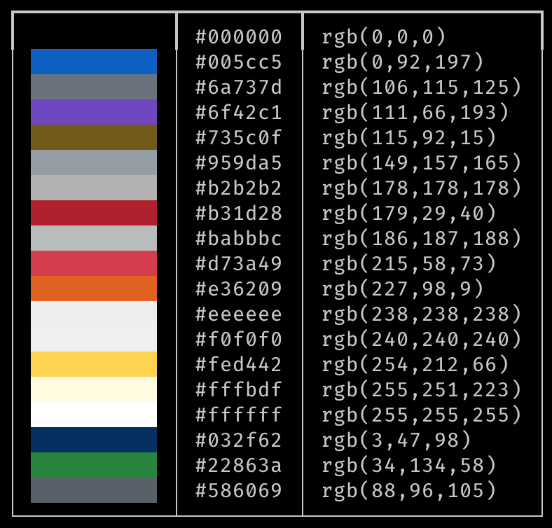
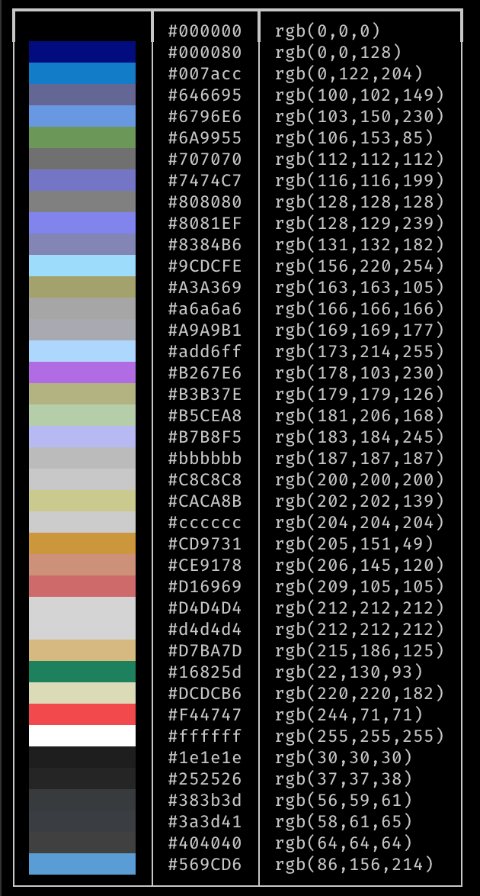

# Visualize the color palette of a VS Code color theme

## Background

I'm using the wonderful [rich](https://github.com/Textualize/rich) python package to beautify the output of some of my python command line [apps](https://github.com/RhetTbull/osxphotos).  I'm not a designer and wanted to pick colors that look good but also wanted to provide themes for dark mode, light mode, as well as color-blind themes.  VS Code has lots of beautiful color themes so why not just use the color palette of one of them?  This script reads a [VS Code color theme](https://code.visualstudio.com/docs/getstarted/themes) JSON file and prints out a pretty palette to the terminal with the rgb values ready to drop into a rich [Style](https://rich.readthedocs.io/en/stable/style.html) object.

## Example

[VS Code Theme Github Light](https://github.com/yunlingz/vscode-theme-github-light)

`python3 theme_colors.py vscode_github_theme_light.json`

[Dark Theme Color Blind](https://github.com/PedroFonsecaDEV/dark-theme-color-blind/tree/master/themes)

`python3 theme_colors.py dark_theme_color_blind.json`

## Installation

- `pip install -r requirements.txt`
- `python3 theme_colors.py theme_file.json`

# License

MIT License. Do whatever you want with this. No Warranty.
